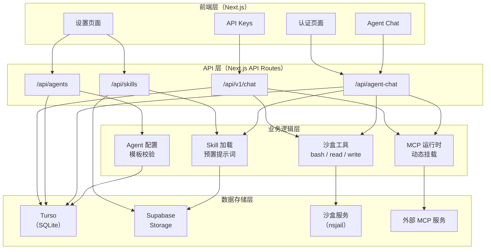

# AI Agent 对话平台

一个基于 Next.js 的 AI Agent 对话平台，支持多模型配置、MCP 工具集成、沙盒代码执行和 Skill 能力扩展。

## 项目定位

本项目旨在构建一个灵活可扩展的 AI Agent 对话平台，让用户能够：

1. **自定义 Agent** - 创建具备特定能力和人格的 AI 助手
2. **集成外部工具** - 通过 MCP 协议连接各类外部服务和数据源
3. **安全执行代码** - 在沙盒环境中安全运行 AI 生成的代码
4. **复用能力模板** - 通过 Skill 系统快速赋予 Agent 新能力
5. **开放 API 接口** - 供外部程序调用，实现自动化集成

## 核心架构



## 主要功能模块

### 1. 用户认证系统 (`docs/项目最新概况/01登录注册鉴权说明.md`)

- **双模式支持**：匿名用户 + 注册用户
- **JWT 认证**：访问令牌 15 分钟，刷新令牌 7 天
- **密码安全**：bcrypt 加密，强度校验
- **数据迁移**：匿名用户注册/登录后自动迁移配置数据

### 2. 模型配置 (`docs/项目最新概况/02模型配置说明.md`)

- **多模型支持**：OpenAI-Compatible 兼容任意 OpenAI 格式 API
- **用户自定义**：每个用户可配置多个模型，设置默认模型
- **密钥加密**：API Key 使用 AES-256-GCM 加密存储
- **Agent 绑定**：Agent 可绑定创建者的特定模型

### 3. Agent 配置 (`docs/项目最新概况/06agent配置说明.md`)

- **模板系统**：内置模板，支持自定义配置
- **公开/私有**：支持公开分享给其他用户
- **工具绑定**：关联 MCP 工具和系统工具
- **Skill 关联**：配置 Skill 自动启用必要系统工具

### 4. Agent Chat (`docs/项目最新概况/07agentchat页面说明.md`)

- **主入口**：`/agent-chat`（新会话）、`/agent-chat/[id]`（已有会话）
- **流式对话**：基于 AI SDK 的流式响应
- **工具执行**：沙盒系统工具 + MCP 运行时工具
- **Skill 加载**：对话开始时自动加载 Skill 文件到沙盒
- **对话压缩**：自动检测长对话并进行历史压缩，压缩结果缓存到数据库

### 5. MCP 工具集成 (`docs/项目最新概况/03mcp与mcptool注册说明.md`)

- **服务注册**：用户可注册 MCP 服务 URL
- **工具同步**：自动同步服务提供的工具列表
- **运行时挂载**：对话时动态建连，白名单筛选
- **尽力模式**：单服务失败不阻断对话

### 6. 沙盒系统 (`docs/项目最新概况/05沙盒服务与对接说明.md`)

- **安全隔离**：基于 nsjail 的进程级隔离
- **核心工具**：bash、readFile、writeFile
- **会话隔离**：每用户独立工作区
- **Skill 加载**：自动将 Skill 文件加载到工作区

### 7. Skill 系统 (`docs/项目最新概况/09Skill管理与加载说明.md`)

- **目录上传**：支持上传包含多个文件的 Skill 目录
- **格式校验**：自动校验 SKILL.md 和 frontmatter
- **Supabase 存储**：文件存储在 Supabase Storage
- **预置提示词**：自动生成 Skill 使用说明注入对话

### 8. API Keys 管理 (`docs/项目最新概况/08API Keys管理说明.md`)

- **长期有效**：用于外部程序调用
- **SHA256 哈希**：密钥不可逆存储
- **使用追踪**：记录最后使用时间

### 9. V1 对外 API (`docs/项目最新概况/10V1对外API说明.md`)

- **API Key 认证**：Bearer Token 方式
- **流式对话**：SSE 流式响应
- **会话管理**：CRUD 操作
- **Agent/Skill 列表**：查询可用资源

## 技术栈

| 层级 | 技术 |
|------|------|
| 前端框架 | Next.js 16, React 19 |
| UI 组件 | Shadcn UI, Tailwind CSS v4 |
| 富文本编辑 | Tiptap v3（Markdown、Code、Math、Mermaid）|
| 后端框架 | Next.js API Routes |
| 数据库 | Turso (LibSQL / SQLite) |
| 文件存储 | Supabase Storage |
| 认证 | JWT + bcrypt |
| AI SDK | @ai-sdk/react, ai (Vercel AI SDK) |
| MCP | @ai-sdk/mcp, @modelcontextprotocol/sdk |
| 搜索 | Tavily AI SDK |
| 沙盒 | Python + nsjail (FastAPI) |
| 语言 | TypeScript 6 |

## 快速开始

```bash
# 安装依赖
npm install

# 配置环境变量
cp .env.example .env.local

# 构建项目
npm run build

# 启动开发服务器
npm run dev
```

### 必需环境变量

```bash
# 数据库（Turso）
TURSO_DATABASE_URL=libsql://your-database.turso.io
TURSO_AUTH_TOKEN=
TURSO_DATABASE_MODE=cloud        # cloud 使用 Turso Cloud；local 使用本地 Turso 数据库
TURSO_SYNC_DATABASE_PATH=data/turso-cloud.db
TURSO_LOCAL_DATABASE_PATH=data/turso-local.db
TURSO_LOCAL_SYNC_URL=            # 可选，本地 sync server 地址
TURSO_SYNC_LONG_POLL_TIMEOUT_MS=0

# JWT 认证
JWT_SECRET=                    # 至少 32 字符
INVITE_CODE=                   # 注册邀请码

# Supabase（Skill 文件存储）
SUPABASE_URL=
SUPABASE_PUBLISHABLE_KEY=      # anon public key
SUPABASE_SECRET_KEY=           # service_role secret key
```

### 可选环境变量

```bash
# 沙盒服务（开启代码执行能力）
SANDBOX_ENABLED=false          # 设为 true 启用
SANDBOX_GATEWAY_URL=           # 沙盒服务地址（HTTPS）
SANDBOX_API_KEY=               # 与沙盒服务配置一致
SANDBOX_IDLE_TIMEOUT_MS=1800000  # 闲置超时，默认 30 分钟
SANDBOX_REQUEST_TIMEOUT_MS=60000 # 请求超时，默认 60 秒

# 预置模型 API Key（可通过界面配置替代）
SILICONFLOW_API_KEY=           # SiliconFlow
STEPFUN_API_KEY=               # StepFun
```

## 项目结构

```
├── app/                      # Next.js App Router
│   ├── agent-chat/           # 主对话入口（新建 + 历史会话）
│   ├── settings/             # 设置中心
│   │   ├── agents/           # Agent 管理
│   │   ├── mcp/              # MCP 服务配置
│   │   ├── skills/           # Skill 管理
│   │   ├── models/           # 模型配置
│   │   ├── api-keys/         # API Key 管理
│   │   ├── files/            # 文件管理
│   │   └── token-test/       # Token 测试工具
│   ├── api/                  # API Routes（38 个路由）
│   │   ├── agent-chat/       # 对话 API（SSE 流式）
│   │   ├── agents/           # Agent CRUD
│   │   ├── skills/           # Skill CRUD
│   │   ├── mcp/              # MCP 服务管理 + 工具同步
│   │   ├── user/             # 用户模型配置
│   │   ├── api-keys/         # API Key 管理
│   │   ├── sandbox/          # 沙盒文件读写
│   │   ├── upload/           # 文件上传
│   │   └── v1/               # 对外 API（Bearer Token）
│   └── (auth)/               # 认证页面（登录/注册）
├── components/               # React 组件（219 个）
│   ├── agent-chat/           # 对话组件库
│   ├── settings/             # 设置页面组件
│   └── auth/                 # 认证组件
├── lib/                      # 核心库
│   ├── auth/                 # JWT + 密码加密
│   ├── db/                   # 数据库操作（11 张表）
│   ├── sandbox/              # 沙盒客户端（工厂模式）
│   ├── agents/               # Agent 逻辑 + MCP 运行时
│   ├── mcp/                  # MCP 协议实现
│   ├── models/               # 模型解析与 Provider 注册
│   ├── chat/                 # 对话压缩
│   ├── skills/               # Skill 加载与校验
│   └── utils/                # 工具函数（限速、路径校验等）
├── hooks/                    # React Hooks
├── sandbox-service/          # 沙盒服务（Python + FastAPI + nsjail）
└── docs/                     # 项目文档（本地留存，不纳入版本库）
    └── 项目最新概况/          # 详细技术文档
```

## 当前进度

### 已完成

- [x] 用户认证系统（匿名 + 注册）
- [x] 模型配置（OpenAI-Compatible）
- [x] Agent 配置与管理
- [x] Agent Chat 流式对话
- [x] MCP 服务注册与运行时挂载
- [x] 沙盒系统部署与集成
- [x] Skill 管理与加载
- [x] API Keys 管理
- [x] V1 对外 API

### 后续规划

- [ ] 性能优化（缓存、连接池）
- [ ] 多语言支持
- [ ] 对话导出与分享
- [ ] Agent 市场与模板库
- [ ] 监控与告警
- [ ] 移动端适配优化

## 文档说明

详细技术文档位于 `docs/项目最新概况/` 目录（本地留存，不纳入版本库）：

| 文档 | 说明 |
|------|------|
| 01登录注册鉴权说明.md | JWT 认证、匿名用户、数据迁移 |
| 02模型配置说明.md | 用户模型、OpenAI-Compatible、密钥加密 |
| 03mcp与mcptool注册说明.md | MCP 服务注册、工具同步、运行时挂载 |
| 04系统内置tool说明.md | 系统工具定义、与 MCP 工具合并 |
| 05沙盒服务与对接说明.md | 沙盒架构、HTTP 契约、Skill 加载 |
| 06agent配置说明.md | Agent CRUD、模板、工具绑定、Skill 关联 |
| 07agentchat页面说明.md | 对话流程、消息持久化、工具注入 |
| 08API Keys管理说明.md | API Key 生成、哈希存储、验证流程 |
| 09Skill管理与加载说明.md | Skill 上传、校验、存储、运行时加载 |
| 10V1对外API说明.md | 对外接口规范、认证、错误码 |

## 开发说明

```bash
# 代码检查
npm run lint

# 构建验证
npm run build

# 类型检查
npm run typecheck
```

## License

MIT
